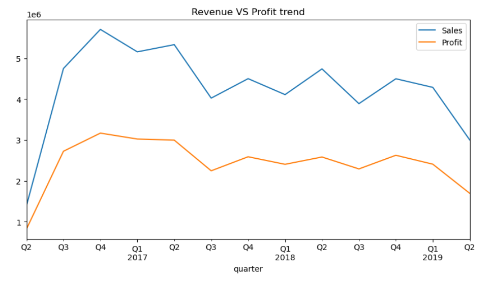
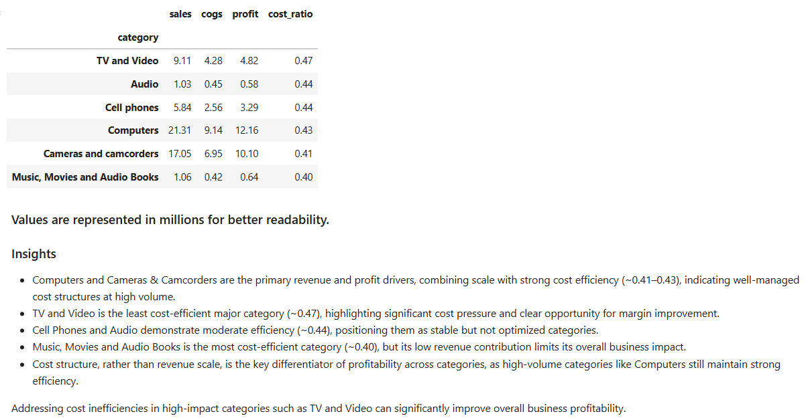
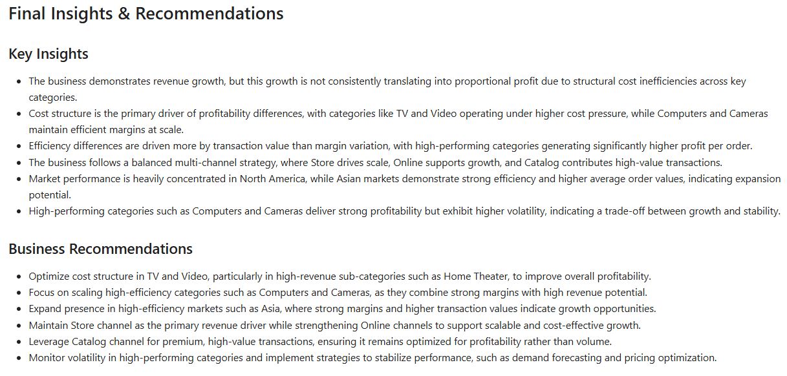

# 📊 Revenue Quality & Business Health Analysis using Python

### Hitesh Garg

**Data Analyst | SQL • Power BI • Excel • Python • Finance Analytics**

---

## Project Overview

Advanced financial business analysis project using Python, Pandas, and Matplotlib to evaluate:

* Revenue quality
* Profitability drivers
* Cost efficiency
* Regional performance
* Variance & trend behavior
* Financial consistency
* Business sustainability

This project focuses not only on revenue growth, but also on understanding whether strong sales actually translate into healthy and sustainable profitability.

---

## Business Objective

The objective of this analysis is to:

* Evaluate business profitability and revenue quality
* Detect structural cost inefficiencies
* Analyze category, region, and market performance
* Identify high-risk and low-efficiency business segments
* Measure cost pressure across categories
* Validate financial consistency in the dataset
* Study quarterly revenue vs profit behavior
* Generate business-focused recommendations

---

## Tools & Libraries

* Python
* Pandas
* NumPy
* Matplotlib
* Jupyter Notebook

---

## Project Structure

```text
finance-business-health-analysis/
│
├── data/
│   ├── company_data.xlsx
│   └── cleaned_finance_data.csv
│
├── notebook/
│   └── finance_analysis.ipynb
│
├── screenshots/
│   ├── Cost_ratio_by_category.png
│   ├── Cost_structure_analysis.png
│   ├── Final_recommendations.png
│   ├── Financial_consistency_check.png
│   ├── Market_performance_analysis.png
│   ├── Regional_profit.png
│   └── Revenue_VS_profit_trend.png
│
└── README.md
```

---

## Key Analysis Areas

### 1. Data Cleaning & Validation

* Duplicate detection
* Column standardization
* Data type validation
* Financial consistency checks
* Recalculated profit validation

---

### 2. Financial KPI Engineering

Created analytical metrics such as:

* Profit Margin
* Cost Ratio
* Profit Per Order
* Calculated Profit
* Quarterly & Time-Based Features

---

### 3. Revenue & Profit Trend Analysis

Analyzed quarterly sales and profit trends to evaluate:

* Revenue growth consistency
* Profit sustainability
* Seasonal business patterns
* Trend volatility



---

### 4. Cost Structure Analysis

Evaluated how efficiently categories convert revenue into profit.

Key metrics:

* Sales
* COGS
* Profit
* Cost Ratio
* Profitability efficiency



---

### 5. Regional & Market Performance

Compared performance across global regions to identify:

* High-efficiency markets
* Revenue concentration
* Regional profitability differences
* Margin stability

---

### 6. Financial Consistency Validation

Validated whether:

```python
Profit = Sales - COGS
```

This helped confirm dataset reliability before deeper analysis.

---

### 7. Strategic Business Recommendations

The project concludes with business-focused recommendations around:

* Cost optimization
* Margin improvement
* Market expansion
* Efficiency scaling
* Profit stabilization



---

## Key Insights

* Revenue growth does not always translate proportionally into profit growth.
* Cost structure is a major driver of profitability differences.
* Certain categories operate under significantly higher cost pressure.
* North America dominates revenue contribution, while Asia demonstrates strong efficiency.
* High-performing categories show higher volatility, indicating a trade-off between growth and stability.
* Financial consistency checks confirmed strong dataset reliability.

---

## Business Recommendations

* Optimize high-cost categories to improve overall profitability.
* Expand efficient markets with strong margins.
* Improve pricing and cost discipline in low-efficiency segments.
* Focus on profitability quality rather than only revenue scale.
* Monitor volatility in high-performing categories.

---

## Repository Contents

* Cleaned dataset
* End-to-end Jupyter Notebook
* Business insights
* Financial KPI engineering
* Analytical charts & screenshots
* Strategic recommendations

---

## How to Run

1. Clone the repository
2. Open the notebook in Jupyter Notebook or VS Code
3. Install required libraries:

```bash
pip install pandas numpy matplotlib
```

4. Run:

```text
notebook/finance_analysis.ipynb
```

---

## Author

### Hitesh Garg

**Data Analyst | SQL • Power BI • Excel • Python • Finance Analytics**
